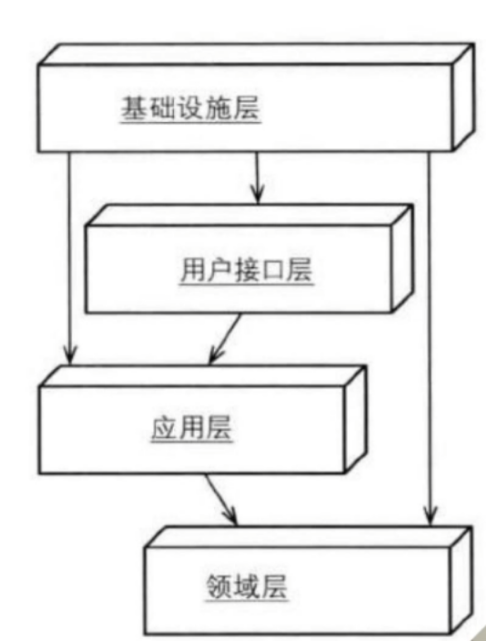
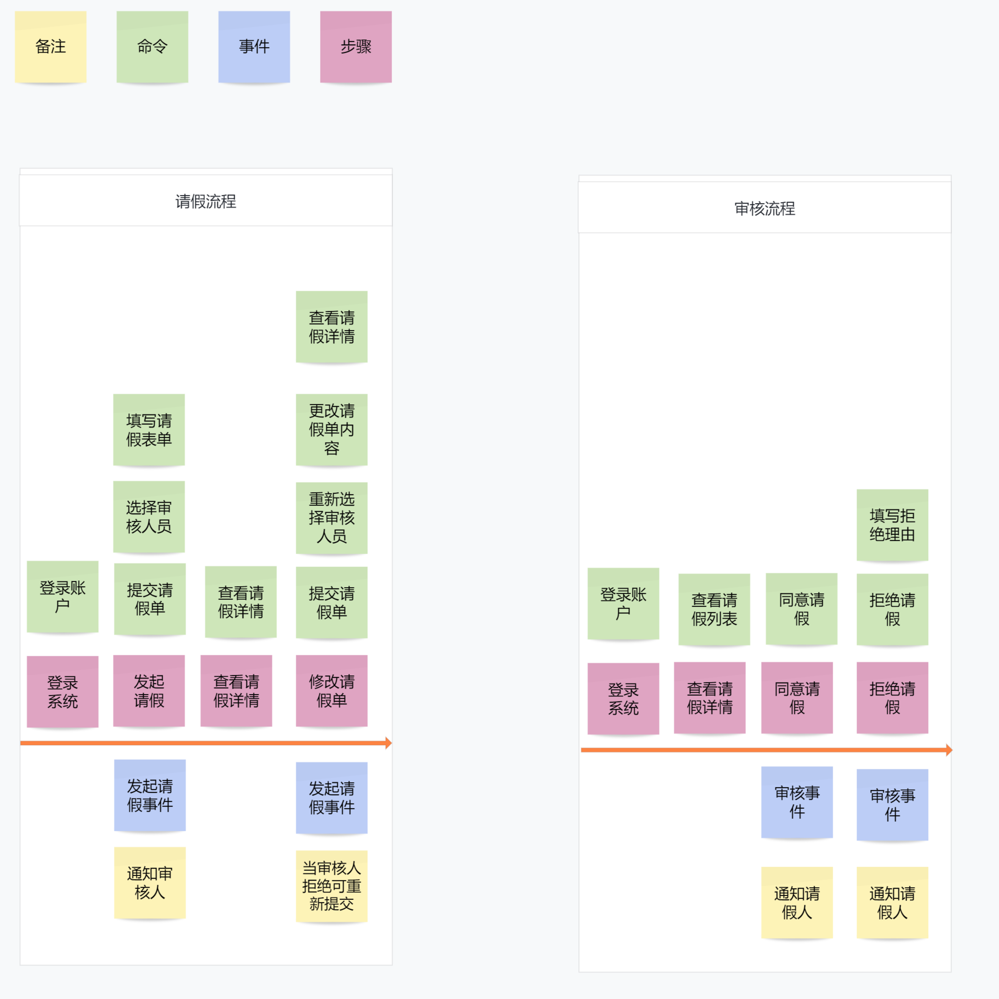

## 项目介绍
- 项目名称：基于ddd架构的请假审批示例
- 架构：改良版的DDD架构，将领域层放到最下面,架构图如下

- DDD开源框架：com.codingapi.springboot
- 使用技术：SpringBoot、Jpa、Jwt
- 开发语言：java
- 开发工具：idea
## 接口功能列表
- 创建用户

- 用户登录

- 查看用户列表

- 发起请假

- 我的请假列表

- 用户登录

- 我的审批列表

- 请假审批

- 请假详情

## 项目背景
为了学习ddd开发流程，初步了解ddd的基本概念，完成ddd简单的入门，所以就有了这个项目。
本项目基于lorne大佬提供的示例手动敲写哦， 强烈推荐去看看大佬的视频和github：
- 大佬说的话：**当你无意间推开这一扇门，将会感叹原来生活可以如此的美好。确实很美好，不行你就试一试**
- ddd framework：https://github.com/codingapi/springboot-framework`

## 推荐DDD的三个理由
- 业务逻辑可视化
- 灵活的业务拓展性
- 轻量化的业务单元测试

## 领域驱动设计开发流程
- 事件风暴：可以用Mural和小画桌这样的软件来完成

- 划分子域：根据事件风暴划分

- 设计模型：根据事件风暴提取核心模型，使用UML完成模型设计

- 编写domain代码&单元测试：编写domain领域层的代码，并完成单元测试的编写，如果单元测试覆盖率高于60%，说明模型质量是可一保证的

- 集成业务：验证单元测试与事件风暴中核心流程无偏差，严格使用改良版ddd架构去按照层次去落地。

## 推荐的框架与软件
- SpringJPA：JPA是ORM框架，可以非常简单的与领域对象相关联。 https://spring.io/projects/spring-data-jpa
- StartUML：画UML设计软件。https://staruml.io/
- Mural：画事件风暴图的软件。https://www.mural.co/
- 小画桌：画事件风暴图、流程图、UML的软件。https://www.xiaohuazhuo.com/